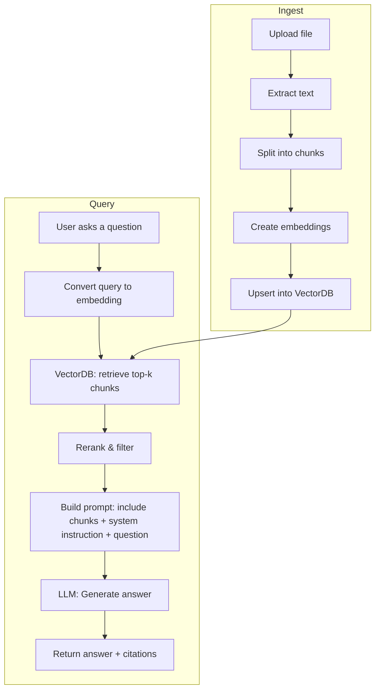

# Constitutional-Chatbot Project Pitch

## 1. One-line summary

Build a Retrieval-Augmented Generation (RAG) chatbot that ingests uploaded constitutional case documents (PDF/DOCX), automatically summarizes them, and answers user questions grounded in the case text and relevant constitutional provisions.

---

## 2. Objectives (What we will deliver)

* Upload and ingest case documents (PDF/DOCX).
* Extract, clean, and chunk legal text with metadata.
* Store semantic vectors in a Vector Database (VectorDB).
* Provide accurate summaries and follow-up Q\&A grounded in the uploaded document(s).
* Show sources and citations for transparency.
* Provide an interface for users to upload documents and chat.

---

## 3. High-level architecture (flowchart)

```mermaid
flowchart LR
  A[User Upload: PDF / DOCX] --> B[Text Extraction]
  B --> C[Text Cleaning & Segmentation]
  C --> D[Embedding Generator]
  D --> E[VectorDB (FAISS / Pinecone / Weaviate)]
  E --> F[Retriever + Ranking]
  F --> G[Prompt Builder (context + question)]
  G --> H[LLM (GPT-4 / LLaMA2 / Mistral)]
  H --> I[Result: Summary / Answer + Citation]
  I --> J[UI: Chat + Source Viewer]
  E --> K[Semantic Cache]
  K --> H
```

---

## 4. Components explained (simple, student-friendly)

### 4.1 Document ingestion

* **What:** Accept PDF / Word files from users.
* **How:** Backend endpoint receives the file, stores it, and triggers the extraction pipeline.
* **Libraries:** `PyMuPDF` / `pdfplumber` / `pdftotext` for PDF; `python-docx` for DOCX.

### 4.2 Text extraction & cleaning

* **Goal:** Convert file to plain text while removing headers, footers, page numbers, and irrelevant noise.
* **Steps:** OCR (if scanned) → text normalization → remove duplicate lines and artifacts → keep page/paragraph metadata.
* **Libraries/tools:** `Tesseract` for OCR, regex-based cleaning functions in Python.

### 4.3 Segmentation / Chunking

* **Goal:** Split long documents into chunks that fit into LLM context windows (recommended 400–1000 tokens).
* **Strategy:** Prefer semantic or legal-section boundaries (facts, issues, arguments, judgment). Add metadata (case name, page number, paragraph id).
* **Why:** Retrieval works at chunk-level; smaller chunks let retriever find highly relevant passages.

### 4.4 Embeddings

* **What:** An embedding is a fixed-length vector (numeric representation) that captures semantic meaning of text.
* **How:** Use embedding models (OpenAI `text-embedding-3-small`, `text-embedding-3-large`, or open-source `sentence-transformers` / `instructor-xl`) to convert chunks into vectors.
* **Why:** Similar meaning → vectors close in vector space; this is how retrievers find relevant chunks.

### 4.5 VectorDB (Vector Database)

* **What:** A database optimized for storing and searching vectors (nearest neighbor search).
* **Examples:** FAISS (local, open-source), Pinecone (managed), Weaviate (managed + schema), Milvus, Qdrant.
* **Operations:** `upsert` vectors with metadata, `query` nearest neighbors by vector similarity, `delete` or `update` when documents change.
* **Why:** Provides the “semantic cache” / grounded store in the pipeline diagram.

### 4.6 Retriever + Reranker

* **Retriever:** Gets top-k relevant chunks for a query using similarity search.
* **Reranker (optional):** Uses a small model to reorder retrieved chunks for better precision.
* **Why:** Improves relevance before feeding context to the LLM.

### 4.7 Prompt builder & LLM

* **Prompt builder:** Composes the final prompt for the LLM by concatenating retrieved chunks (with citations), user query, and system instruction (e.g., role: legal summarizer).
* **LLM choices:** OpenAI GPT-4/4o (cloud), Anthropic Claude, or open-source LLaMA-2 / Mistral / Falcon (self-hosted) depending on budget and data privacy needs.
* **Why:** LLM generates the human-readable summary or answers anchored in the retrieved context.

### 4.8 Semantic cache

* **What:** Cache of recent or frequently asked queries and their embeddings / responses.
* **Why:** Speed: if a similar question was already answered, return cached answer (reduce cost and latency).

### 4.9 UI / Presentation

* **What:** Web interface with file upload, chat window, and source viewer (shows which chunk(s) the answer is based on).
* **Why:** Transparency and user trust (show relevant paragraphs + page numbers).

---

## 5. Dataset & Sources (where to get legal data for testing/fine-tuning)

* **Public legal repositories:** Indian Kanoon, Supreme Court of India website, high court databases.
* **Constitutional texts:** The official text of the Constitution of India (articles, schedules).
* **Annotated datasets:** Look for Indian legal Q\&A datasets on Kaggle or Hugging Face (instruction-style pairs).
* **Private datasets:** If collaborating with a law school or firm, obtain anonymized judgments and case briefs.

> **Minimum dataset for prototype:** 50–200 representative cases (covering different constitutional issues).
> **Better dataset for evaluation:** 500–2000 cases or curated Q\&A pairs.

---

## 6. Fine-tuning vs RAG (which to pick and when)

* **RAG-first (recommended for your project):** Use an off-the-shelf LLM + retrieval. Fast to build, lower cost, keeps data fresh.
* **Fine-tune later (optional):** After you collect usage logs and corrections, you can instruction-tune or LoRA-finetune a smaller model for better domain behavior.

**Recommendation:** Start with a RAG prototype using GPT-4 or a good open-source model. Only invest in PEFT/QLoRA fine-tuning if you need improved legal phrasing or offline deployment.

---

## 7. Example end-to-end sequence (detailed flowchart)



---

## 8. Implementation stack (recommended tools)

* **Backend:** Python + FastAPI / Flask
* **Text extraction:** PyMuPDF, pdfplumber, python-docx, Tesseract (OCR)
* **Embeddings:** OpenAI embeddings API or `sentence-transformers` / `instructor` models
* **VectorDB:** FAISS (local) / Pinecone / Weaviate / Qdrant / Milvus
* **Orchestration:** LangChain (to glue retriever, re-ranker, prompt builder, LLM)
* **LLM Providers:** OpenAI (ChatGPT/GPT-4), Anthropic Claude, or self-hosted (LLaMA-2, Mistral)
* **Frontend:** React / Next.js with a simple chat UI; use Tailwind CSS for styling
* **Storage:** S3-compatible (for raw files) + Postgres (metadata)

---

## 9. Example prompts & prompt template

**System instruction (fixed):**

> You are a legal assistant. Use only the provided document excerpts to answer the user. Quote relevant lines and provide the paragraph/page number when possible. If the document does not support the answer, say "I don't know — the document does not provide enough information." Keep answers concise.

**User prompt template:**

```
Context:
[CHUNK 1] (source: page 4, para 3)
[CHUNK 2] (source: page 7, para 2)

Question: {user_question}

Answer in <200 words>. Provide citations in the format: (CaseName — p4, para3).
```

---

## 10. Evaluation plan & metrics

* **Correctness / Grounding:** Percentage of answers that are supported by cited passages (human-evaluated).
* **Factual accuracy:** Human-annotated correctness on a 100-question test set.
* **ROUGE / BLEU:** For summarization quality (automatic scores).
* **Latency:** Time between query and response (target < 2–3s for retrieval, < 10s end-to-end).
* **User satisfaction:** Survey (thumbs up/down + free text).

---

## 11. Minimal viable product (MVP) timeline (8–10 weeks)

* **Week 1:** Requirements, dataset collection (50–200 cases), UI mockups.
* **Week 2–3:** Build ingestion pipeline (upload + text extraction + chunking).
* **Week 4:** Build embeddings + set up VectorDB.
* **Week 5:** Implement retrieval & prompt builder, connect LLM for summarization.
* **Week 6:** Chat UI + display citations.
* **Week 7:** Testing, evaluation, user feedback collection.
* **Week 8:** Improve retrieval, add caching, prepare demo & documentation.

---

## 12. Resources & cost estimate (rough)

* **Development time:** 1–2 people (students) for 8–10 weeks.
* **Compute:** Cloud GPU (if fine-tuning): \$200–\$2000 depending on scale.
* **VectorDB:** Pinecone paid tier (small) \~\$20–\$200/mo; FAISS local (free).
* **LLM API usage:** GPT-4 calls for RAG prototype — variable. Budget \$50–\$500/month depending on usage.
* **Storage & hosting:** \$5–\$50/month for small prototypes.

---

## 13. Risks & mitigations

* **Hallucinations:** Mitigate with RAG (citation + show chunks) and conservative system instruction.
* **Privacy / sensitive data:** Remove PII, or run self-hosted LLM + on-prem VectorDB if required.
* **Legal accuracy:** Always include human-in-the-loop review for high-stakes answers; add disclaimers.

---

## 14. Future extensions

* Add automated extraction of legal issues, precedents, and timeline of facts.
* Add a citation verification module and case-law mapping across precedents.
* Add fine-tuning (PEFT / LoRA) once you have 5k–20k curated QA pairs.

---

## 15. Appendix: Quick glossary (for non-technical reviewers)

* **LLM (Large Language Model):** A model trained on large text corpora that can generate natural language answers (e.g., GPT-4).
* **Embedding:** A vector numeric representation of text encoding its meaning.
* **VectorDB:** A database that stores embeddings and finds nearest neighbors (similar text).
* **RAG (Retrieval-Augmented Generation):** Method that retrieves relevant documents and uses an LLM to generate grounded answers.
* **PEFT / LoRA / QLoRA:** Low-cost fine-tuning techniques that change only a small fraction of model parameters.

---

*Open to customizing this document for a slide deck, or converting sections into diagrams for a 10-minute presentation.*
